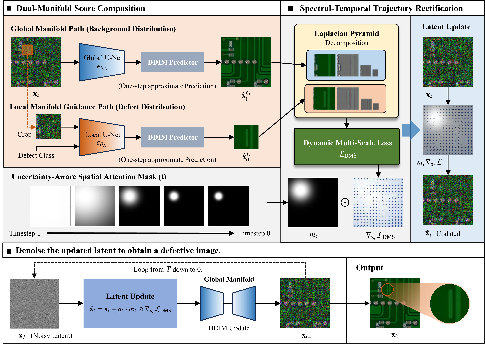

# Dual-Manifold Score Composition (DMSC)

## Overview

This repository contains the official implementation of **"Dual-Manifold Score Composition: High-Fidelity Synthesis for Enhanced Industrial Defect Detection"**.


*Figure 1: The overall architecture of the Dual-Manifold Score Composition (DMSC) framework.*

### Key Contributions

- **Dual-Manifold Score Composition**: Reformulates the generation process as constrained sampling at the intersection of the global background manifold and the local defect manifold. A dual-stream score estimation mechanism explicitly decomposes the gradient field, enabling precise injection of defect morphologies while preserving background regularity.
- **Spectral-Temporal Trajectory Rectification**: Enforces physical consistency through spectral-temporal trajectory rectification, which aligns high-frequency spectral components while adapting to spatial uncertainty.
- **Asymmetric Collaborative Evolution**: A dynamic modulation strategy is employed to dynamically modulate the interaction between structural anchoring and textural resonance throughout the generative trajectory.

## Installation

- Python 3.8+ recommended
- PyTorch (CUDA recommended). Install the version matching your CUDA. If you see an error about weights_only when loading checkpoints, upgrade PyTorch to a recent 2.x release.
- Other Python packages: numpy, pyyaml, pillow, matplotlib

## Model Checkpoints

### Pre-trained Models

You need to download the following pre-trained models and place them in the `checkpoint/` directory:

**Note**: If you want to use your own dataset, you can train custom models based on the [OpenAI guided-diffusion](https://github.com/openai/guided-diffusion) library and adjust the corresponding configuration parameters accordingly.

#### 1. Global Context Model (global-256.pt)

This model is used for the global context or first-stage processing.

- **Filename**: `global-256.pt`
- **Download Link**: [Download from Google Drive](https://drive.google.com/uc?export=download&id=1axJMm0fpg0v2HIApxz0IIaY0WTDKalCH)

You can download it directly using the command line:

```bash
wget -O checkpoint/global-256.pt "https://drive.google.com/uc?export=download&id=1axJMm0fpg0v2HIApxz0IIaY0WTDKalCH"
```

#### 2. Defect Patch Model (defect-patch-64.pt)

This model is used for fine-grained defect analysis on patches.

- **Filename**: `defect-patch-64.pt`
- **Download Link**: [Download from Google Drive](https://drive.google.com/uc?export=download&id=1GHT-q1XjF_aCmInp_g5gMruX3yih-iyM)

You can download it directly using the command line:

```bash
wget -O checkpoint/defect-patch-64.pt "https://drive.google.com/uc?export=download&id=1GHT-q1XjF_aCmInp_g5gMruX3yih-iyM"
```

### Directory Structure After Setup

```bash
checkpoint/
├── global-256.pt          # Global context model
└── defect-patch-64.pt     # Local defect patch model
```

## Quick start

1) Verify checkpoints are in checkpoint/.
2) Use the provided config confs/pcb_gen.yml (FJ-DDIM sampler by default).
3) Run synthesis:

```bash
python Gen.py --conf_path confs/pcb_gen.yml
```

Outputs will be saved under images/fj_ddim/:

- images/fj_ddim/samples/: generated samples
- images/fj_ddim/gird/: grids of intermediate predictions
- images/fj_ddim/crop/: defect patch crops

Reproducibility: pcb_gen.yml sets a fixed seed and enables deterministic modes in CUDA (see Gen.py), but minor nondeterminism may remain depending on your driver/BLAS settings.

### Configuration

The main configuration file is `confs/pcb_gen.yml`.

## Project Structure

```text
CGD/
├── Gen.py                      # Main generation script
├── confs/                      # Configuration files
│   └── pcb_gen.yml            # Main config
├── guided_diffusion/           # Core implementation
│   ├── ddim.py                # DMSC sampler implementation
│   ├── script_util.py         # Utility functions
│   ├── gaussian_diffusion.py  # Base diffusion model
│   └── unet.py                # U-Net architecture
├── utils/                      # Utility modules
│   ├── config.py              # Configuration management
│   ├── logger.py              # Logging utilities
│   └── drawer.py              # Visualization tools
├── data/                       # Dataset and references
│   ├── pcb.json               # PCB dataset configuration
│   └── Fig1.pdf               # Framework diagram
├── checkpoint/                 # Model checkpoints
│   ├── global-256.pt          # Global context model
│   └── defect-patch-64.pt     # Local defect model
└── images/                     # Generated outputs
    └── fj_ddim/               # DMSC results
```

## Citation and License

### Citation

Please cite our work if you find this code useful for your research:

```bibtex
@article{luo2025dmsc,
  title={Dual-Manifold Score Composition: High-Fidelity Synthesis for Enhanced Industrial Defect Detection},
  author={Luo, Weihang and Huang, Jianxiongwen and Zhang, Zhijie and Zhang, Hongyi and Jiang, Huali and Gao, Xingen},
  journal={Sensors},
  year={2025},
  publisher={MDPI}
}
```


This project is licensed under the [CC BY-NC-SA 4.0](https://creativecommons.org/licenses/by-nc-sa/4.0/) license. The code is released for academic research use only. For commercial use, please contact the authors.
